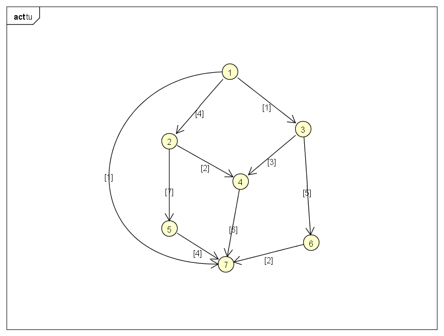

## 前言
首先可以回顾一下图的表示，参考:图的邻接表表示
- 什么是单源最短路径
从一个顶点到所有顶点的最短路径
- Dijkstra算法的局限
Dijkstra算法只适用于无负权的图

## Dijkstra算法求单源最短路径
````java
public static <T> Map<GraphNode<T>, Integer> dijkstra(GraphNode<T> root) {
    Map<GraphNode<T>, Integer> distances = new HashMap<>();

    Deque<GraphNode<T>> queue = new LinkedList<>();

    queue.offerLast(root);
    distances.put(root, 0);

    while (queue.size() > 0) {
        GraphNode<T> fromNode = queue.pollFirst();
        GraphSide<T> side = fromNode.getSide();
        while (side != null) {
            int priority = side.getPriority();

            int newDistance = distances.get(fromNode) + priority;

            GraphNode<T> toNode = side.getNode();
            if (distances.get(toNode) == null) {
                // 第一次到达时
                distances.put(toNode, newDistance);
                queue.offerLast(toNode);
            } else if (distances.get(toNode) > newDistance) {
                // 有更近的路径
                distances.put(toNode, newDistance);
            }

            side = side.getNext();
        }
    }
    return distances;
}
````
## 测试
首先构造这样一个图:

````java
public static void main(String[] args) {
    GraphNode<Integer> n1 = new GraphNode<>(1);
    GraphNode<Integer> n2 = new GraphNode<>(2);
    GraphNode<Integer> n3 = new GraphNode<>(3);
    GraphNode<Integer> n4 = new GraphNode<>(4);
    GraphNode<Integer> n5 = new GraphNode<>(5);
    GraphNode<Integer> n6 = new GraphNode<>(6);
    GraphNode<Integer> n7 = new GraphNode<>(7);


    n1.side(1, n3).side(4, n2).side(1, n5);
    n2.side(2, n4).side(7, n5);
    n3.side(3, n4).side(5, n6);
    n4.side(6, n7);
    n5.side(4, n7);
    n6.side(2, n7);

    Map<GraphNode<Integer>, Integer> distance = dijkstra(n1);

    distance.forEach((node, dis)->{
        System.out.println(String.format("from node %s to node %s, distance is: %s",n1, node, dis));
    });
}
````
## 输出
````log
from node [1] to node [3], distance is: 1
from node [1] to node [4], distance is: 4
from node [1] to node [7], distance is: 5
from node [1] to node [5], distance is: 1
from node [1] to node [6], distance is: 6
from node [1] to node [1], distance is: 0
from node [1] to node [2], distance is: 4
````